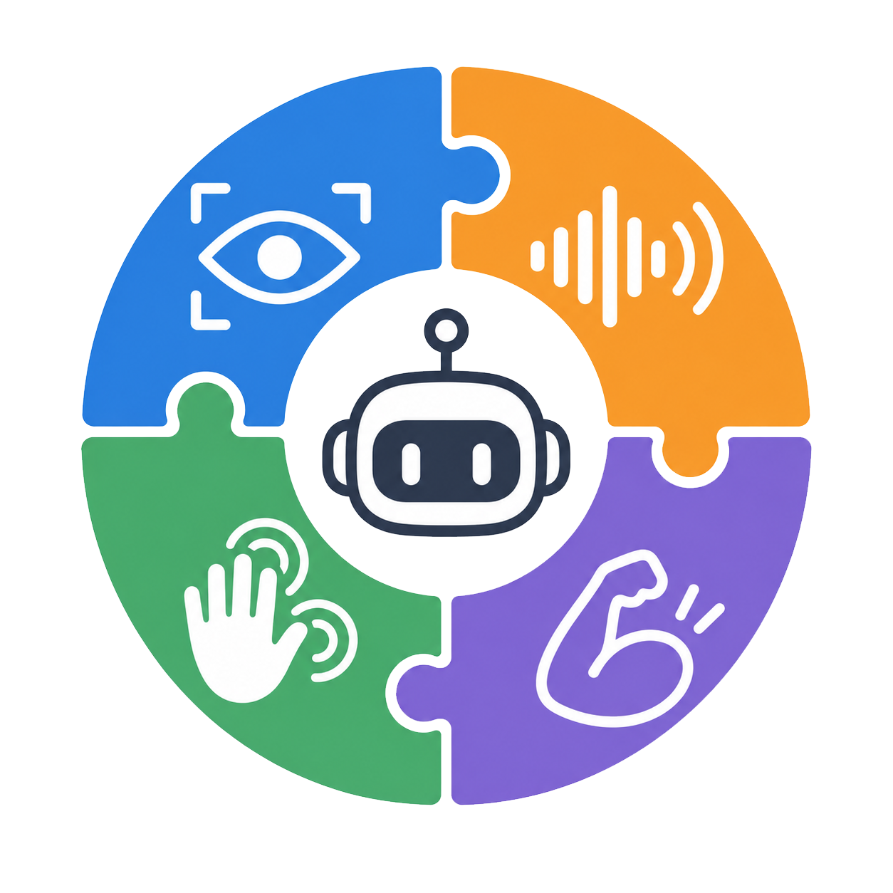
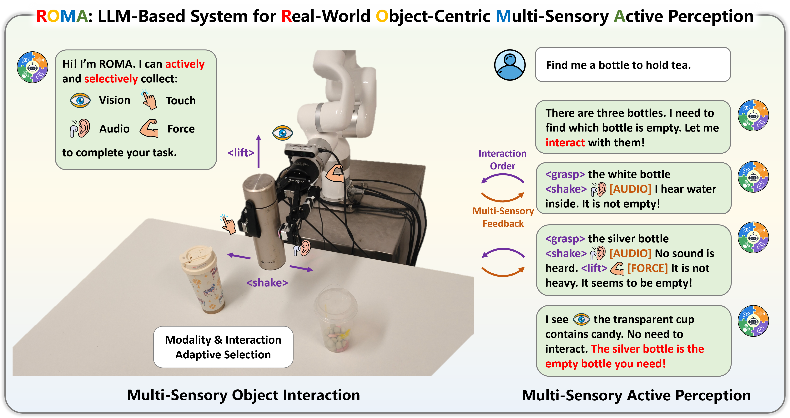
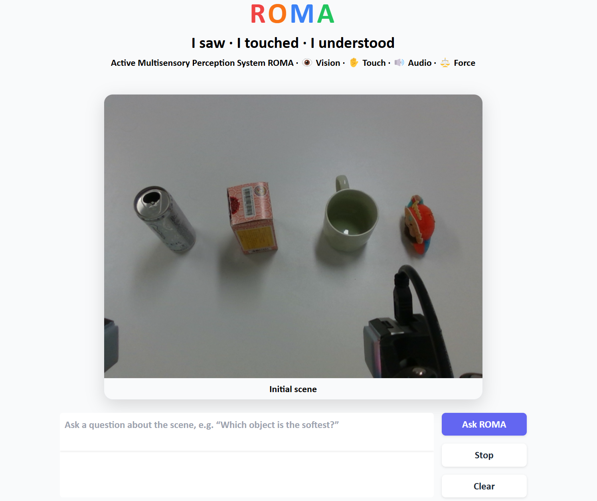

<p align="center">
  
</p>

<h1 align="center">ROMA: LLM System for Real-World Object-Centric<br>Multi-Sensory Active Perception</h1>

<h3 align="center"><em>I saw. I touched. I understood.</em></h3>

<p align="center">
  <a href="https://gewu-lab.github.io/ROMA/"></a>
  <a href="https://huggingface.co/datasets/GeWu-Lab/ROMA"></a>
  <a href="https://github.com/GeWu-Lab/ROMA"></a>
</p>
<p align="center">
  <a href="https://xxuan01.github.io/">Ruoxuan Feng</a><sup>*</sup>, <a href="https://github.com/gitagitty">Yutong Chen</a><sup>*</sup>, <a href="https://scholar.google.com.hk/citations?user=v5LctN8AAAAJ">Ruihua Song</a>, <a href="https://hyang0511.github.io/">Huan Yang</a>, <a href="https://www.wangzhongyuan.com/">Zhongyuan Wang</a>, <a href="https://scholar.google.com/citations?user=FLkv_vIAAAAJ">Guocai Yao</a>, <a href="https://dtaoo.github.io/">Di Hu</a><sup>&#9993;</sup>
  <br>
  <sup>*</sup>Equal contribution &nbsp; <sup>&#9993;</sup>Corresponding author
</p>


---

## Introduction

<p align="center">
  
</p>

Humans build an understanding of the physical world through an active process: when sensory evidence is insufficient, we decide **what** information is missing, **how** to acquire it, and **when** enough evidence has been obtained. Existing multi-sensory robot systems, in contrast, mostly integrate whatever sensory inputs they are given.

**ROMA** is an LLM-based system for **R**eal-World **O**bject-Centric **M**ulti-Sensory **A**ctive Perception. It integrates vision, audio, touch, and force into a *reasoning-interaction-feedback* loop: the LLM identifies the missing evidence and selects the target object, the interaction (`lift`, `press`, `collide`, `shake`, `rotate`, `squeeze`), and the sensory modalities, while a physical interface executes the interaction and returns the multi-sensory feedback.

This repository accompanies the paper and contains:

- **ROMA-7B**, a multi-sensory LLM built on [Qwen2.5-Omni](https://github.com/QwenLM/Qwen2.5-Omni) with action / modality tokens, an audio branch, and an [AnyTouch 2](https://github.com/GeWu-Lab/AnyTouch2) tactile branch, trained with multi-sensory alignment followed by active-perception SFT.
- **ROMI-2K**, a real-world multi-sensory object interaction dataset covering nearly 2,000 objects and 6 atomic interactions with synchronized visual, audio, tactile, and force feedback. (Coming Soon!)
- **ROMA Bench**, 2,100 scene-level tasks (single-chain, multi-chain, and intent-driven) for evaluating active perception. (Coming Soon!)
- A local **web demo** that streams ROMA's active-perception process on a real tabletop scene.

### Highlights

| Model | ROMA Bench (total) | Real-world execution (total) |
| :--- | :---: | :---: |
| GPT-5.4 | 43.5 | 40.2 |
| Gemini 3.5 Flash | 53.0 | 41.7 |
| Qwen 2.5-Omni | 22.0 | 23.5 |
| Qwen 3-Omni | 19.7 | 23.5 |
| **ROMA-7B** | **72.9** | **61.4** |

Task success rate (%). See the paper for the full results.

## Demo

<p align="center">
  
</p>

The demo runs locally. Given the initial scene image and a question, ROMA reasons step by step; whenever it emits an action token, the corresponding recorded feedback (wrist image, tactile images, contact sound, gravity force) is loaded from `resources/example_data/1` and fed back to the model, and generation continues until it answers. Everything is streamed to the page:

- every `grasp` is drawn on the scene image as a numbered, colored box;
- each interaction is shown as an *Interaction & Feedback* card with the returned sensory evidence;
- the final answer is highlighted.

See [Usage](#usage) to launch it.

## Installation

```bash
conda create -n roma python=3.10.20
conda activate roma

pip install torch==2.6.0 torchvision==0.21.0 torchaudio==2.6.0 --index-url https://download.pytorch.org/whl/cu124
pip install -r requirements.txt
```

**(Optional)** Install [FlashAttention](https://github.com/Dao-AILab/flash-attention) for faster inference. If installed, enable it by uncommenting the `attn_implementation="flash_attention_2"` line in `demo.py`.

## Usage

### 1. Download the checkpoint and dataset

Before running, pull [GeWu-Lab/ROMA](https://huggingface.co/datasets/GeWu-Lab/ROMA) from Hugging Face into the `resources` directory:

```bash
hf download GeWu-Lab/ROMA --repo-type dataset --local-dir resources
```

The ROMA-7B checkpoint directory (`ROMA-Qwen2.5-Omni-7B`) is expected to contain:

```
ROMA-Qwen2.5-Omni-7B/
├── xxx.safetensors     # base Qwen2.5-Omni-7B model
├── anytouch2.pth        # tactile encoder
├── audio.bin            # fine-tuned audio adapter and encoder
├── tactile.bin          # fine-tuned tactile adapter
└── ROMA-LLM.bin         # ROMA LLM weights
```

### 2. Run the web demo

```bash
python demo.py --model_path /path/to/ROMA-Qwen2.5-Omni-7B --gpu 0 --port 7860
```

Then open `http://localhost:7860`, type a question (or pick an example), and press **Ask ROMA**. `--model_path` is the only required path: the base model and all adapters are loaded from that directory, in the same order as during training (base Qwen2.5-Omni, tactile encoder, new tokens, audio adapter, tactile adapter, ROMA LLM). Other options: `--host`, `--port`, `--share` (create a public Gradio link).

## Repository Structure

```
ROMA
├── demo.py                # local web demo (Gradio)
├── qwen25omni/            # Qwen2.5-Omni modified with the tactile modality
├── anytouch2/             # tactile encoder
├── my_qwen_omni_utils/    # audio / vision / tactile input processing
├── config/, utils/        # arguments, DeepSpeed and checkpoint utilities
└── resources/             # checkpoints, datasets, and the demo example scene
```

## TODO

- [x] Release the local web demo
- [x] Release ROMA-7B checkpoint and the ROMI-2K dataset
- [ ] Release the ROMA Bench evaluation code
- [ ] Release the training code (multi-sensory alignment and active-perception SFT)
- [ ] Release the physical interface (grasp interface and interaction execution)

## Citation

If you find this work useful, please consider citing:

```bibtex
@article{feng2026roma,
  title   = {ROMA: LLM System for Real-World Object-Centric Multi-Sensory Active Perception},
  author  = {Feng, Ruoxuan and Chen, Yutong and Song, Ruihua and Yang, Huan and Wang, Zhongyuan and Yao, Guocai and Hu, Di},
  journal = {arXiv preprint},
  year    = {2026}
}
```

## Acknowledgements

ROMA builds on [Qwen2.5-Omni](https://github.com/QwenLM/Qwen2.5-Omni), [AnyTouch 2](https://github.com/GeWu-Lab/AnyTouch2), and [AnyGrasp](https://github.com/graspnet/anygrasp_sdk). We thank the authors for their open-source contributions.
